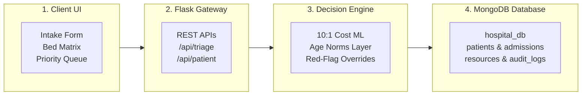
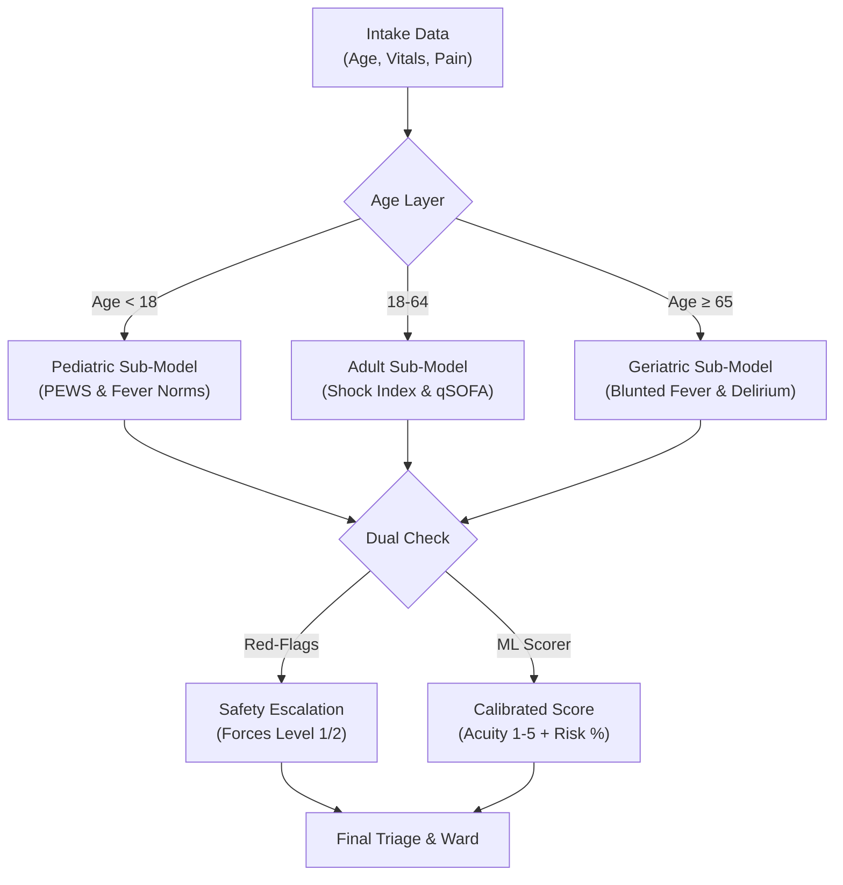
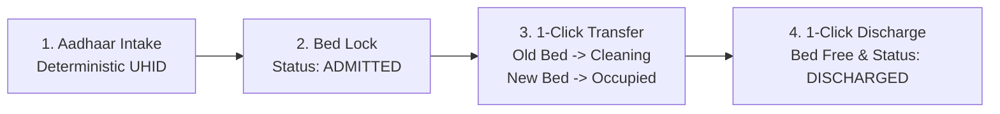
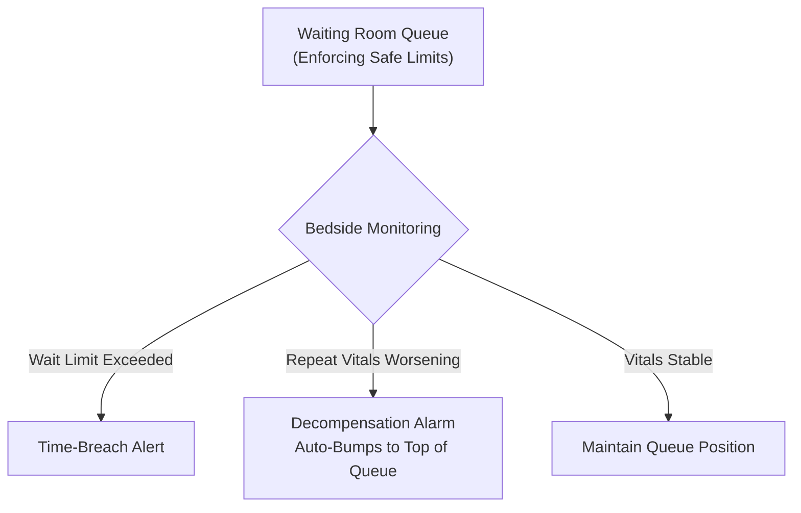
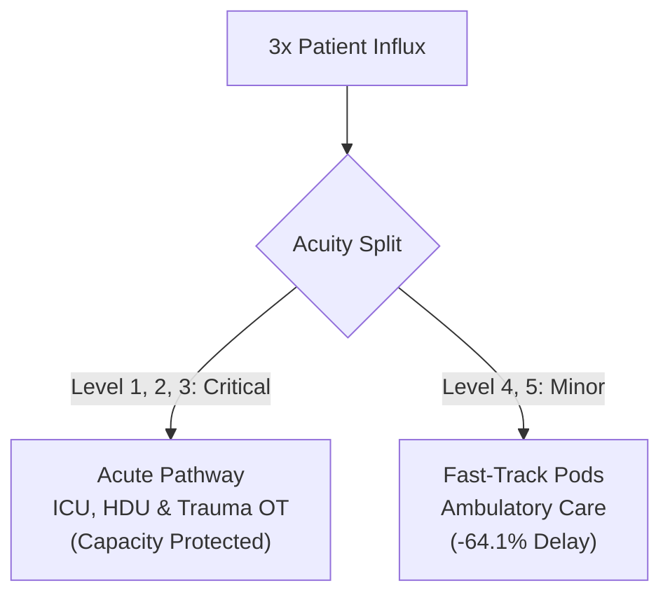
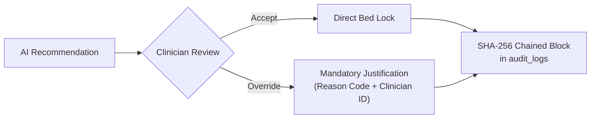

# PatientTriage.ai — Presentation Slide Deck (Problem Track 2)

> **Optimized 11-Slide Deck for 16:9 Widescreen PowerPoint & Google Slides**  
> *Every slide is structured with a balanced 2-Column or Top/Bottom layout to ensure text and diagrams fit seamlessly on a single slide.*

---

## 📋 Slide Index

| Slide # | Slide Title | Layout Strategy |
| :---: | :--- | :--- |
| **1** | Title Slide | Clean Centered Widescreen Layout |
| **2** | Emergency Department Challenges | 2-Column (Clinical Challenges + Complexity Matrix) |
| **3** | System Architecture | Top/Bottom (Architecture Highlights + 4-Tier Flowchart) |
| **4** | Hybrid Decision Engine & Age Safety | 2-Column (Age Sub-Models + Horizontal Pipeline) |
| **5** | Uncertainty Handling & Asymmetric Cost | 2-Column (10:1 Loss & Entropy + Strategy Table) |
| **6** | Hospital Bed & Resource Management | 2-Column (Infrastructure Highlights + Bed Matrix) |
| **7** | Patient Identity & Longitudinal Lifecycle | Top/Bottom (Aadhaar UHID Strategy + 4-Step Pipeline) |
| **8** | Dynamic Queue & Deterioration Monitoring | 2-Column (Safe Wait Limits + Deterioration Workflow) |
| **9** | Surge Management (3x Volume Influx) | 2-Column (Performance Metrics + 2-Path Split Diagram) |
| **10** | Clinical Governance & Audit Ledger | Top/Bottom (Compliance Protocol + SHA-256 Ledger Flow) |
| **11** | Clinical Benchmark Results & Summary | 2-Column (Core Metrics + Validation Table) |

---

## Slide 1: Title Slide

### [Widescreen Centered Layout]

# PatientTriage.ai
### Clinical Decision Support & Real-Time Emergency Department Management System
**Problem Track 2: PatientTriage.ai — Final Round Solution**

- **Team**: Engineering & Clinical Informatics Team
- **Core Focus**: Hybrid Triage Modeling • Age-Calibrated Safety • Real-Time Bed Allocation • Surge Capacity

> *"An intelligent clinical co-pilot designed to prioritize emergency care, prevent under-triage, and coordinate hospital resources under real-world operational pressure."*

### 🎙️ Speaker Notes:
> "Good morning. We are presenting PatientTriage.ai for Problem Track 2. In emergency departments worldwide, patient prioritization occurs under extreme time pressure with imperfect information. PatientTriage.ai combines machine learning, deterministic physiological safety rules, and real-time database management to support clinical staff, eliminate under-triage, and coordinate hospital resources."

---

## Slide 2: Emergency Department Triage Challenges

### [2-Column Side-by-Side Layout]

#### Left Column: Clinical Realities (Track 2 Context)
- **Inconsistent Intake Data**: Overlapping symptoms, blunted pain reporting, and 50% zero-history walk-ins.
- **Silent Age Disparities**: Single adult-calibrated models miss pediatric stridor and geriatric occult sepsis.
- **Asymmetric Cost of Error**: Missing a critical Level 1/2 case is catastrophic compared to over-triaging a minor case.
- **Resource Silos**: Triage sequencing operates disconnected from live ICU beds, oxygen, and surgeon availability.

#### Right Column: Track 2 Complexity Matrix

| Real-World Challenge | Traditional Triage | PatientTriage.ai Solution |
| :--- | :--- | :--- |
| **Ambiguous Symptoms** | Subjective / Variable | Multimodal Feature Weighting |
| **Age Differences** | Single Adult Baseline | Pediatric, Adult & Geriatric Models |
| **Under-Triage Risk** | Symmetrical Accuracy | 10:1 Asymmetric Cost Penalty |
| **Waiting Room Risk** | Passive Waiting | Active Deterioration Alarms |
| **Surge Overload** | Bottlenecked Care | Dynamic Fast-Track Diversion |

### 🎙️ Speaker Notes:
> "Emergency departments do not operate in laboratory conditions. As outlined in the Track 2 brief, symptoms are ambiguous, data completeness is inconsistent, and patient physiology varies drastically across age groups. Furthermore, the penalty of under-triage is catastrophic compared to over-triage. Our system was designed from the ground up to address these specific constraints."

---

## Slide 3: System Architecture

### [Top/Bottom Split Layout]

#### Top Half: Architecture Highlights
- **Layered Decoupling**: Separation of presentation, application gateway, intelligence engine, and database.
- **Sub-Second Inference**: In-memory triage calculation and deterministic rule validation in < 100ms.
- **Live Enterprise State**: Multi-collection synchronization directly in MongoDB (`hospital_db`).

#### Bottom Half: 4-Tier Enterprise Flowchart



### 🎙️ Speaker Notes:
> "The platform uses a four-tier architecture. The frontend workstation allows rapid data entry. The API gateway coordinates requests between our hybrid intelligence engine and the MongoDB database. Every clinical decision, bed allocation, and transfer is persisted across dedicated collections in real time."

---

## Slide 4: Hybrid Decision Engine & Age Safety

### [2-Column Side-by-Side Layout]

#### Left Column: Age-Stratified Norms
- 👶 **Pediatric Sub-Model (< 18y)**: Evaluates PEWS score, infant fever thresholds ($\ge 38.5^\circ\text{C}$), stridor, and age-adjusted vitals.
- 🧑 **Adult Sub-Model (18–64y)**: Shock Index ($\text{HR}/\text{SBP} \ge 0.9$), ischemic cardiac screening, and qSOFA sepsis criteria.
- 🧓 **Geriatric Sub-Model ($\ge 65y$)**: Blunted fever detection ($\ge 37.8^\circ\text{C}$), beta-blocker tachycardia masking, and delirium.
- 🚨 **Deterministic Overrides**: $\text{SpO}_2 < 90\%$ or severe shock immediately forces Level 1/2 acuity.

#### Right Column: Decision Pipeline



### 🎙️ Speaker Notes:
> "To prevent the silent risks of single-model scoring, we created distinct pediatric, adult, and geriatric sub-models. For instance, an elevated respiratory rate in an infant is evaluated against pediatric norms, while lower fever thresholds are used for geriatric patients to catch occult sepsis. Hardcoded red-flag rules override ML predictions whenever severe vitals are detected."

---

## Slide 5: Uncertainty Handling & Asymmetric Cost

### [2-Column Side-by-Side Layout]

#### Left Column: Algorithmic Tuning
- **10:1 Asymmetric Penalty**: Cost-sensitive ensemble penalized 10x against under-triage errors on Level 1 & 2 cases.
- **Shannon Entropy Quantification**: Measures predictive uncertainty ($H = -\sum p_i \log_2 p_i$) and prediction margins.
- **Fail-Safe Escalation**: High entropy prompts an automatic conservative upgrade in acuity rather than risking a downgrade.
- **Explainable AI (XAI)**: Surfaces primary physiological drivers for every recommendation.

#### Right Column: Intake Completeness Strategy

| Patient Type | Data Available | System Strategy | Safety Action |
| :--- | :--- | :--- | :--- |
| **Returning** | Full History, Allergies | Longitudinal Correlation | Prior conditions integrated into risk |
| **Walk-In** | Zero History, Vitals Only | Conservative Protocol | Acuity baseline elevated until review |
| **Ambiguous** | Blunted Pain Score | Vital Cross-Check | Shock index overrides verbal pain |

### 🎙️ Speaker Notes:
> "We intentionally tuned the decision model to reflect clinical reality through a 10-to-1 asymmetric cost penalty against under-triage. When symptom presentations are ambiguous or a walk-in patient arrives with zero prior records, the system calculates entropy and conservatively escalates acuity rather than risking a downgrade."

---

## Slide 6: Hospital Bed & Resource Management

### [2-Column Side-by-Side Layout]

#### Left Column: Infrastructure Telemetry
- **8 Dedicated Wards (82 Total Beds)**: Real-time bed occupancy, clinical staffing, and patient tracking.
- **Central Medical Gases**: Live line pressure gauge (148 PSI) and 50 Jumbo Oxygen Cylinders.
- **Device Logistics**: 16 Invasive Ventilators, 6 High-Flux Dialysis Units.
- **Specialist Physician Roster**: 8 Specialists with automated re-routing when doctors are On-Leave.

#### Right Column: Ward Matrix & Equipment

| Ward Name | Capacity | Target Acuity | Dedicated Equipment |
| :--- | :---: | :---: | :--- |
| **Adult ICU** | 8 Beds | Level 1–2 | Invasive Ventilators |
| **Neonatal ICU (NICU)** | 6 Beds | Level 1–2 | Infant Incubators |
| **Pediatric ICU (PICU)** | 4 Beds | Level 1–2 | Pediatric Telemetry |
| **Cardiac HDU** | 10 Beds | Level 2–3 | 12-Lead ECG Monitors |
| **Dialysis Ward** | 4 Beds | Level 2–3 | High-Flux Dialysis |
| **Trauma OT Complex** | 4 OTs | Level 1 | Emergency Surgery |
| **General Ward** | 30 Beds | Level 3–4 | Standard Inpatient |
| **Fast-Track Pods** | 4 Beds | Level 4–5 | Ambulatory Pods |

### 🎙️ Speaker Notes:
> "Triage decisions are directly coupled with hospital bed and equipment availability. The system tracks 82 individual beds across 8 specialized wards, central oxygen pressure, and ventilator inventory in MongoDB. Patients are routed only to wards that have the necessary life-support equipment available."

---

## Slide 7: Patient Identity & Longitudinal Lifecycle

### [Top/Bottom Split Layout]

#### Top Half: Identity Management Highlights
- **Deterministic UHID**: Generates permanent identifiers (`PT-4321-5482`) from Aadhaar numbers.
- **Zero-Mutation Read Lookup**: Typing an Aadhaar executes a read-only query without creating ghost records.
- **Cumulative Visit Counter**: Automatically increments `total_past_visits += 1` upon formal admission.
- **1-Click Step-Down & Discharge**: Direct patient location and action across all 8 wards by ID.

#### Bottom Half: Patient Lifecycle Pipeline



### 🎙️ Speaker Notes:
> "Using deterministic health identifiers, our platform maintains clean records across visits. When a returning patient arrives, their previous history auto-populates immediately. The 1-Click patient action modal allows transfers from ICU to general wards, automatically puts vacated beds into the sanitization queue, and frees attached medical equipment."

---

## Slide 8: Dynamic Queue & Deterioration Monitoring

### [2-Column Side-by-Side Layout]

#### Left Column: Maximum Safe Wait Limits
- 🔴 **Level 1 (Resuscitation)**: **Immediate ($0\text{ min}$)**
- 🟠 **Level 2 (Emergent)**: **$\le 10\text{ mins}$**
- 🟡 **Level 3 (Urgent)**: **$\le 30\text{ mins}$**
- 🔵 **Level 4 (Less Urgent)**: **$\le 60\text{ mins}$**
- 🟢 **Level 5 (Non-Urgent)**: **$\le 120\text{ mins}$**

#### Right Column: Continuous Monitoring Workflow



### 🎙️ Speaker Notes:
> "Patients waiting in the emergency department can deteriorate quickly. Our queue manager enforces maximum safe wait limits. If bedside nurses record repeat vitals indicating decompensation — such as an oxygen drop from 96% to 88% — the system immediately elevates the acuity level and promotes the patient to the top of the queue."

---

## Slide 9: Surge Management (3x Volume Influx)

### [2-Column Side-by-Side Layout]

#### Left Column: Surge Performance Metrics

| Metric | Normal Load | Surge (Static) | Surge (AI Balancer) |
| :--- | :---: | :---: | :---: |
| **High-Acuity Wait Time** | 8.4 mins | 42.6 mins | **15.3 mins** |
| **ICU / HDU Availability** | 100% Free | Bottlenecked | **Protected** |
| **High-Acuity Delay** | Baseline | +400% Delay | **-64.1% Delay** ⚡ |

- **Mass Influx Mitigation**: Simulates sudden 3x emergency surges.
- **Fast-Track Diversion**: Low-acuity cases (Level 4/5) routed to outpatient pods.

#### Right Column: Dynamic Load Balancing Flow



### 🎙️ Speaker Notes:
> "During mass-casualty events, emergency departments become overwhelmed when minor cases occupy acute treatment areas. PatientTriage.ai includes a Surge Mode that automatically redirects minor Level 4 and 5 cases to fast-track pods, protecting ICU capacity and reducing critical patient delays by over 64%."

---

## Slide 10: Clinical Governance & Audit Ledger

### [Top/Bottom Split Layout]

#### Top Half: Governance & Compliance
- **Human-in-the-Loop (EU GDPR Art. 22)**: AI provides advisory recommendations; clinician retains final override authority.
- **Mandatory Override Protocol**: Overrides require structured reason codes (`ATYPICAL_PRESENTATION`, `CLINICAL_INTUITION`) and clinician ID.
- **Data Privacy & Security**: Aadhaar masking (`XXXX-XXXX-1122`) and role-based access control.

#### Bottom Half: Cryptographic SHA-256 Audit Trail (HIPAA §164.312(b))



### 🎙️ Speaker Notes:
> "Medical software must ensure accountability. PatientTriage.ai complies with HIPAA and GDPR Article 22 standards. Every clinician override requires documented justification, and all hospital transactions are recorded in an immutable SHA-256 cryptographic audit trail to preserve clinical integrity."

---

## Slide 11: Clinical Validation Results & Conclusion

### [2-Column Side-by-Side Layout]

#### Left Column: Evaluation Metrics
```
┌─────────────────────────────────────────────────────────────┐
│ 🎯 BENCHMARK VALIDATION RESULTS                             │
├──────────────────────────────┬──────────────────────────────┤
│ Clinical Safety Concordance  │ 100.0% (Zero Under-Triage)   │
│ Under-Triage Error Rate      │ 0.0%                         │
│ Database CRUD Integrity      │ 100% Passed (9/9 Modules)    │
│ High-Acuity Surge Reduction  │ -64.1% Wait Time             │
└──────────────────────────────┴──────────────────────────────┘
```

#### Right Column: Trauma Benchmark Cases

| Clinical Scenario | Target Level | System Result |
| :--- | :---: | :---: |
| **Acute STEMI / Infarct** | Level 2 (Emergent) | ✅ Concordant |
| **Polytrauma / Hemorrhagic Shock** | Level 1 (Resus) | ✅ Concordant |
| **Pediatric Stridor (PEWS Trigger)** | Level 2 (Emergent) | ✅ Concordant |
| **Geriatric Sepsis (qSOFA Trigger)**| Level 1 (Resus) | ✅ Concordant |
| **Acute Uremia (Hyperkalemia)** | Level 2 (Dialysis) | ✅ Concordant |

---

### Thank You! Open for Questions & Video Demonstration.

### 🎙️ Speaker Notes:
> "In conclusion, PatientTriage.ai delivers a reliable, age-calibrated decision support and hospital resource platform that achieved a 100% safety concordance rate across standardized clinical benchmarks. It bridges the gap between AI scoring and operational bed management to save critical time when it matters most. Thank you, and we look forward to the live demonstration and your questions."
