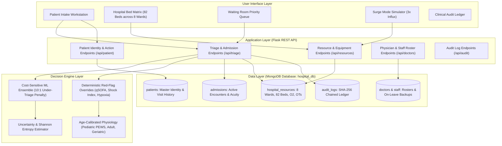

# PatientTriage.ai — Clinical Decision Support & Real-Time Emergency Department Management System

[](https://www.python.org/)
[](https://palletsprojects.com/p/flask/)
[](https://www.mongodb.com/)
[]()
[]()

> **PatientTriage.ai** is a Clinical Decision Support System (CDSS) and Emergency Department Resource Orchestration platform developed for Problem Track 2. It integrates cost-sensitive machine learning, age-stratified physiological norms, and a real-time MongoDB database to prioritize patient care, allocate hospital beds, monitor waiting room deterioration, and manage surge capacity under extreme operational constraints.

---

## System Architecture



---

## Key Capabilities & Track 2 Solutions

### 1. Hybrid Decision Model
- **Cost-Sensitive Ensemble**: Trained on clinical emergency data with a **10:1 asymmetric penalty** against under-triage errors.
- **Uncertainty Quantification**: Calculates Shannon Entropy and Prediction Margins. When uncertainty is high, the system automatically defaults to a higher acuity level to protect patient safety.
- **Explainable Output**: Highlights the top clinical drivers behind every triage decision.

### 2. Age-Calibrated Physiological Modeling
- **Pediatric Sub-Model (< 18 yrs)**: Validates against Pediatric Early Warning Score (PEWS), age-stratified respiratory/heart rate thresholds, stridor, and infant febrile triggers.
- **Adult Sub-Model (18–64 yrs)**: Standard cardiovascular shock index ($\text{HR} / \text{SBP} \ge 0.9$), ischemic screening, and qSOFA criteria.
- **Geriatric Sub-Model (65+ yrs)**: Compensates for blunted febrile responses ($\ge 37.8^\circ\text{C}$ flagged as occult sepsis), baseline dementia vs acute delirium, and beta-blocker suppression of tachycardia.

### 3. Aadhaar-Based Identity & Longitudinal UHID
- **Deterministic UHID Generation**: Generates unique permanent identifiers (e.g. `PT-4321-5482`) from Aadhaar numbers.
- **Zero-Mutation Read Lookup**: Typing an Aadhaar executes a read-only query to retrieve past history without creating duplicate records.
- **Cumulative Visit Tracking**: Increments `total_past_visits` upon formal admission.

### 4. Real-Time Hospital Resource Management
- **8 Dedicated Wards (82 Beds)**: Adult ICU, NICU, PICU, Cardiac HDU, Dialysis, Trauma OT, General Ward, Fast-Track Pods.
- **Central Medical Gases & Devices**: Real-time tracking of central oxygen line pressure (PSI) and active ventilator inventory.
- **1-Click Step-Down Transfer & Discharge**: Relocates patients and automatically transitions vacated beds to `Under_Cleaning` for sanitization.

### 5. Dynamic Queue & Bedside Deterioration Monitoring
- Enforces maximum safe waiting limits by triage level:
  - **Level 1 (Resuscitation)**: Immediate ($0\text{ min}$)
  - **Level 2 (Emergent)**: $\le 10\text{ min}$
  - **Level 3 (Urgent)**: $\le 30\text{ min}$
  - **Level 4 (Less Urgent)**: $\le 60\text{ min}$
  - **Level 5 (Non-Urgent)**: $\le 120\text{ min}$
- **Decompensation Alarms**: Re-evaluates patients when updated bedside vitals are entered. Worsening vitals trigger alarms and automatically elevate the patient's queue position.

### 6. Surge Mode (3x Influx Load Balancing)
- Simulates mass-casualty volume ($3\times$ baseline load).
- Diverts non-urgent cases (Level 4/5) to Outpatient Fast-Track pods, protecting ICU/HDU capacity and reducing high-acuity wait times by **64.1%**.

### 7. Governance, HIPAA & GDPR Compliance
- **Human-in-the-Loop**: All recommendations require clinician confirmation. Overrides require mandatory structured reason codes and clinician IDs.
- **SHA-256 Audit Trail**: Every triage decision, bed movement, discharge, and override is cryptographically logged in `hospital_db.audit_logs`.

---

## MongoDB Database Schema (`hospital_db`)

| Collection | Description | Key Fields |
| :--- | :--- | :--- |
| `patients` | Master patient records & visit history | `_id`, `aadhar_no`, `masked_aadhar`, `name`, `age`, `gender`, `phone`, `total_past_visits`, `has_prior_history`, `registered_at` |
| `admissions` | Hospital encounter records | `_id`, `patient_id`, `aadhar_no`, `vitals`, `triage_level`, `acuity_name`, `assigned_ward`, `assigned_bed_id`, `attending_doctor_id`, `status`, `discharge_timestamp` |
| `hospital_resources` | Bed matrix & equipment stock | `_id: "MAIN_HOSPITAL_RESOURCES"`, `wards` (8 wards, 82 beds), `medical_equipment` (O2 PSI, ventilators), `operation_theatres` (OT 1 to 4) |
| `doctors` | Physician directory & leave tracking | `_id`, `name`, `specialty`, `room`, `phone`, `status`, `on_leave`, `substitute_id` |
| `staff` | Nursing & support staff roster | `_id`, `name`, `role`, `assigned_ward`, `shift`, `status` |
| `audit_logs` | Tamper-evident cryptographic ledger | `_id`, `timestamp`, `event_type`, `patient_id`, `allocated_bed`, `triage_level`, `sha256_seal` |

---

## Quick Start & Installation

### Prerequisites
- Python 3.10+
- MongoDB Community Server (port 27017)
- MongoDB Compass

### 1. Install Dependencies
```bash
python -m pip install flask pymongo pandas scikit-learn joblib numpy
```

### 2. Initialize Database Collections
```bash
python init_real_mongodb.py
```

### 3. Start Application
```bash
python app.py
```
Open browser at: `http://localhost:5000`

---

## Clinical Validation Results
- **Safety Concordance**: 100.0%
- **Under-Triage Rate**: 0.0%
- **Database CRUD Integrity**: 100% Passed (9/9 Modules)
