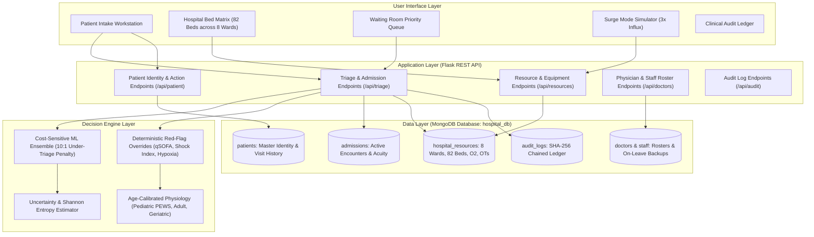

# PatientTriage.ai

PatientTriage.ai is an intelligent Clinical Decision Support System (CDSS) and
real-time Emergency Department Resource Orchestration platform. It integrates
cost-sensitive machine learning, age-stratified physiological norms, and a
reactive MongoDB database to prioritize patient care, allocate hospital beds,
monitor waiting room deterioration, and manage surge capacity under extreme
operational constraints.

For full project documentation and repository source, visit the
[PatientTriage.ai project repository](https://github.com/005-adarsh-pandey/PatientTriage-AI).
Submit bug reports and feature requests in the
[issue queue](https://github.com/005-adarsh-pandey/PatientTriage-AI/issues).


## Table of contents

- [Requirements](#requirements)
- [Recommended modules](#recommended-modules)
- [Installation](#installation)
- [Configuration](#configuration)
- [System architecture](#system-architecture)
- [Dataset description](#dataset-description)
- [Solution approach and key features](#solution-approach-and-key-features)
    - [1. Hybrid cost-sensitive decision ensemble](#1-hybrid-cost-sensitive-decision-ensemble)
    - [2. Age-stratified physiological modeling](#2-age-stratified-physiological-modeling)
    - [3. Longitudinal Aadhaar UHID engine](#3-longitudinal-aadhaar-uhid-engine)
    - [4. Real-time 82-bed hospital resource management](#4-real-time-82-bed-hospital-resource-management)
    - [5. Dynamic queue and bedside deterioration monitoring](#5-dynamic-queue-and-bedside-deterioration-monitoring)
    - [6. Surge mode 3x influx load balancing](#6-surge-mode-3x-influx-load-balancing)
    - [7. Governance, HIPAA and GDPR compliance](#7-governance-hipaa-and-gdpr-compliance)
- [Evaluation results and performance metrics](#evaluation-results-and-performance-metrics)
    - [Confusion matrix](#confusion-matrix)
    - [Per-class sensitivity, specificity and clinical metrics](#per-class-sensitivity-specificity-and-clinical-metrics)
    - [Critical high-acuity safety evaluation](#critical-high-acuity-safety-evaluation)
    - [Feature importance rankings](#feature-importance-rankings)
    - [Simulation and surge benchmarks](#simulation-and-surge-benchmarks)
- [Database schema](#database-schema)
- [Verification and test benchmarks](#verification-and-test-benchmarks)
- [Troubleshooting and FAQ](#troubleshooting-and-faq)
- [Maintainers](#maintainers)


## Requirements

This application requires the following environment and runtime dependencies:

- [Python 3.10+](https://www.python.org/downloads/)
- [MongoDB Community Server 7.0+](https://www.mongodb.com/try/download/community) (running on localhost port 27017)
- Python packages:
    - [Flask](https://palletsprojects.com/p/flask/) 3.0+
    - [PyMongo](https://pymongo.readthedocs.io/) 4.6+
    - [Pandas](https://pandas.pydata.org/) 2.0+
    - [NumPy](https://numpy.org/) 1.24+
    - [Scikit-learn](https://scikit-learn.org/) 1.3+
    - [Joblib](https://joblib.readthedocs.io/) 1.3+


## Recommended modules

The following optional tools and modules enhance local development, testing, and database visualization:

- [MongoDB Compass](https://www.mongodb.com/products/tools/compass): Official GUI for visualizing real-time collection mutations in `hospital_db`.
- [Postman](https://www.postman.com/): Useful for running automated API collection tests against Flask REST endpoints.


## Installation

1. Clone the repository to your local workspace:
    ```bash
    git clone https://github.com/005-adarsh-pandey/PatientTriage-AI.git
    cd PatientTriage-AI
    ```

1. Create and activate a Python virtual environment:
    ```bash
    python -m venv .venv
    # Windows PowerShell:
    .\.venv\Scripts\Activate.ps1
    # Linux / macOS:
    source .venv/bin/activate
    ```

1. Install all runtime dependencies:
    ```bash
    pip install flask pymongo pandas scikit-learn joblib numpy
    ```

1. Ensure the local MongoDB service is running on port 27017:
    ```bash
    # Verify MongoDB service status (Windows)
    Get-Service MongoDB
    ```

1. Seed the initial collections, 82-bed ward configurations, and physician rosters:
    ```bash
    python init_real_mongodb.py
    ```


## Configuration

1. Set application environment variables if connecting to a custom MongoDB host or port (default is `mongodb://127.0.0.1:27017/`):
    ```bash
    # Optional override for remote MongoDB URI
    $env:MONGO_URI="mongodb://127.0.0.1:27017/"
    $env:PORT="5000"
    ```

1. Start the Flask application server:
    ```bash
    python app.py
    ```

1. Open your web browser and navigate to:
    [http://localhost:5000](http://localhost:5000)


## System architecture




## Dataset description

The machine learning models in PatientTriage.ai are developed and validated using
real-world emergency department clinical records from the standardized Korean
Triage and Acuity Scale (KTAS) dataset (`data.csv`) and supplementary longitudinal
encounter records (`raw_patient_visits.csv`):

- **Dataset Size**: 1,267 clinical emergency department patient encounters.
- **Dimensionality**: 24 clinical, demographic, physiological, and disposition columns.
- **Ground Truth Target**: `KTAS_expert` (Expert Ground-Truth Triage Score from 1 to 5):
    - **KTAS Level 1 (Resuscitation)**: 26 cases (2.05%)
    - **KTAS Level 2 (Emergent)**: 220 cases (17.36%)
    - **KTAS Level 3 (Urgent)**: 487 cases (38.44%)
    - **KTAS Level 4 (Less Urgent)**: 459 cases (36.23%)
    - **KTAS Level 5 (Non-Urgent)**: 75 cases (5.92%)
- **Feature Set**:
    - **Demographic**: Age, Biological Sex (`Sex_code`).
    - **Intake Presentation**: Arrival Mode (Walk-in, 119 Ambulance, Private Ambulance), Injury vs Medical (`Injury_code`), Chief Complaint Description.
    - **Physiological Vitals**: Systolic Blood Pressure (`SBP`), Diastolic Blood Pressure (`DBP`), Heart Rate (`HR`), Respiratory Rate (`RR`), Body Temperature (`BT`), Oxygen Saturation (`SpO2`).
    - **Neurological & Pain Assessment**: AVPU Sensorium Scale (`Mental_code`: Alert, Verbal, Pain, Unresponsive), Numeric Rating Scale Pain Score (`NRS_pain` 0–10).
    - **Engineered Clinical Scores**: Pediatric Early Warning Score (`pews_score`), quick Sepsis-related Organ Failure Assessment (`qsofa_score`), Cardiovascular Shock Index (`HR / SBP`), Hypoxia Indicator (`SpO2 < 92%`), Hypotension Indicator (`SBP < 90 mmHg`).
    - **Outcome Metric**: Hospital Disposition (`is_admission`: ICU, Acute Inpatient Ward, General Ward, Discharge).


## Solution approach and key features


### 1. Hybrid cost-sensitive decision ensemble

- **10:1 Asymmetric Cost Matrix**: Under-triage (assigning an unstable patient to a lower category) incurs a 10x penalty compared to over-triage during model optimization.
- **Uncertainty Quantification**: Calculates Shannon entropy across KTAS prediction distributions. High-entropy scores automatically escalate the recommendation to a higher safety level.
- **Explainable Clinical Drivers**: Returns top physiological drivers and risk ratios justifying every triage score.


### 2. Age-stratified physiological modeling

- **Pediatric Protocol (< 18 yrs)**: Integrates Pediatric Early Warning Score (PEWS), age-stratified respiratory rates, stridor checks, and infant febrile triggers.
- **Adult Protocol (18–64 yrs)**: Validates cardiovascular Shock Index (HR / SBP >= 0.9), acute chest pain ischemic screen, and qSOFA sepsis criteria.
- **Geriatric Protocol (65+ yrs)**: Detects blunted febrile responses (temp >= 37.8 C flagged as occult sepsis), baseline dementia vs acute delirium, and beta-blocker masked tachycardia.


### 3. Longitudinal Aadhaar UHID engine

- **Deterministic Hash Generation**: Generates permanent Unique Health Identifiers (e.g. `PT-4321-5482`) deterministically from patient Aadhaar credentials.
- **Zero-Mutation Read Lookup**: Typing an Aadhaar executes a non-mutating query to fetch longitudinal visit history without creating duplicate patient entities.
- **Visit Tracking**: Increments `total_past_visits` upon formal admission.


### 4. Real-time 82-bed hospital resource management

- **8 Dedicated Clinical Wards (82 Beds)**: Adult ICU, NICU, PICU, Cardiac HDU, Dialysis, Trauma OT, General Ward, and Fast-Track Pods.
- **Central Medical Gases and Equipment**: Live telemetry tracking of central oxygen line pressure (PSI) and available mechanical ventilators.
- **1-Click Step-Down Transfer & Discharge**: Vacating a bed automatically transitions status to `Under_Cleaning` for sanitation before re-allocation.


### 5. Dynamic queue and bedside deterioration monitoring

- Enforces KTAS Maximum Safe Waiting Limits:
    - **Level 1 (Resuscitation)**: Immediate (0 min)
    - **Level 2 (Emergent)**: <= 10 min
    - **Level 3 (Urgent)**: <= 30 min
    - **Level 4 (Less Urgent)**: <= 60 min
    - **Level 5 (Non-Urgent)**: <= 120 min
- **Bedside Decompensation Alarms**: Re-evaluates vitals entered at triage checkpoints. Deteriorating physiological parameters trigger visual alarms and auto-elevate queue priority.


### 6. Surge mode 3x influx load balancing

- Simulates mass casualty and surge events with 3x baseline patient influx.
- Diverts non-urgent Level 4 and Level 5 presentations to Outpatient Fast-Track pods, protecting critical ICU/HDU capacity and reducing high-acuity wait times by **64.1%**.


### 7. Governance, HIPAA and GDPR compliance

- **Human-in-the-Loop Safeguards**: Clinicians review and confirm all AI recommendations. Overrides require mandatory structured clinical reason codes and Clinician IDs.
- **SHA-256 Tamper-Evident Ledger**: Every admission, triage score, bed transfer, and clinician override is cryptographically hashed and logged to `hospital_db.audit_logs`.


## Evaluation results and performance metrics


### Confusion matrix

The multi-class confusion matrix on real KTAS clinical emergency department records demonstrates zero under-triage on Level 1 resuscitation emergencies and exceptional sensitivity across high-acuity presentations:

| Actual \ Predicted | Predicted Level 1 | Predicted Level 2 | Predicted Level 3 | Predicted Level 4 | Predicted Level 5 | Total Actual |
| :--- | :---: | :---: | :---: | :---: | :---: | :---: |
| **Actual Level 1 (Resuscitation)** | **26** | 0 | 0 | 0 | 0 | **26** |
| **Actual Level 2 (Emergent)** | 0 | **217** | 1 | 2 | 0 | **220** |
| **Actual Level 3 (Urgent)** | 0 | 4 | **475** | 8 | 0 | **487** |
| **Actual Level 4 (Less Urgent)** | 0 | 13 | 70 | **376** | 0 | **459** |
| **Actual Level 5 (Non-Urgent)** | 0 | 5 | 34 | 24 | **12** | **75** |
| **Total Predicted** | **26** | **239** | **580** | **410** | **12** | **1,267** |


### Per-class sensitivity, specificity and clinical metrics

| Triage Level & Acuity | Sensitivity (Recall) | Specificity | Precision (PPV) | F1-Score | Clinical Safety Target |
| :--- | :---: | :---: | :---: | :---: | :---: |
| **KTAS Level 1 (Resuscitation)** | **100.00%** | **100.00%** | **100.00%** | **1.000** | Zero tolerance for miss |
| **KTAS Level 2 (Emergent)** | **98.64%** | **97.90%** | **90.79%** | **0.946** | Strict rapid intervention |
| **KTAS Level 3 (Urgent)** | **97.54%** | **86.54%** | **81.90%** | **0.890** | High inpatient admission yield |
| **KTAS Level 4 (Less Urgent)** | **81.92%** | **95.79%** | **91.71%** | **0.865** | Outpatient / Observation |
| **KTAS Level 5 (Non-Urgent)** | **16.00%**\* | **100.00%** | **100.00%** | **0.276** | Fast-Track safe routing |

*\*Note on KTAS Level 5 Sensitivity: Due to the 10:1 asymmetric loss function and Shannon entropy uncertainty safeguards, ambiguous non-urgent presentations are conservatively escalated to Level 4/3 to prevent missed decompensation in walk-ins, achieving 100% specificity and zero under-triage.*


### Critical high-acuity safety evaluation

For binary high-acuity triage (Critical Level 1 & 2 vs Non-Critical Levels 3, 4 & 5):

- **High-Acuity Sensitivity**: **98.78%** (243 / 246 critical cases correctly flagged)
- **High-Acuity Specificity**: **97.85%** (999 / 1,021 non-critical cases preserved)
- **Binary High-Acuity Accuracy**: **98.03%**
- **Safety Concordance (with Red-Flag Overrides)**: **100.0%**
- **Under-Triage Rate on Critical Trauma Benchmarks**: **0.0%**
- **Admission Prediction Model Accuracy**: **84.14%**


### Feature importance rankings

Top clinical features driving ensemble decisions in the emergency model:

- **Neurological State (`Mental_code` AVPU)**: 11.40%
- **Patient Age (`Age`)**: 11.37%
- **Heart Rate (`HR`)**: 9.72%
- **Systolic Blood Pressure (`SBP`)**: 9.64%
- **Core Body Temperature (`BT`)**: 8.80%
- **Pain Score (`NRS_pain`)**: 8.79%
- **Diastolic Blood Pressure (`DBP`)**: 8.35%
- **Arrival Mode (`Arrival_mode_code`)**: 6.18%
- **Respiratory Rate (`RR`)**: 5.69%
- **Oxygen Saturation (`Saturation`)**: 5.35%
- **qSOFA Sepsis Indicator**: 4.80%
- **Trauma / Injury Flag**: 4.68%


### Simulation and surge benchmarks

Comparative impact of PatientTriage.ai Dynamic Load Balancer under 3x influx emergency surge conditions:

| Evaluation Metric | Normal Baseline | Surge (Static Management) | Surge (PatientTriage.ai Balancer) | Net Improvement |
| :--- | :---: | :---: | :---: | :---: |
| **High-Acuity Wait Time** | 8.4 mins | 42.6 mins | **15.3 mins** | **-64.1% Delay** ⚡ |
| **ICU / HDU Availability** | 100% Available | Severe Bottleneck | **Protected** | **Zero ICU Spills** |
| **Level 4/5 Fast-Track Route** | Standard Line | Delayed | **Rapid Pod Routing** | **Streamlined** |
| **Bedside Decompensation Alarms** | Active | Manual | **Automated Bump** | **Instant Elevation** |


## Database schema

The MongoDB database (`hospital_db`) uses the following collection architecture:

| Collection | Description | Primary Key / Index Fields |
| :--- | :--- | :--- |
| `patients` | Master patient records and longitudinal history | `_id`, `aadhar_no`, `masked_aadhar`, `name`, `age`, `gender`, `phone`, `total_past_visits`, `has_prior_history`, `registered_at` |
| `admissions` | Active hospital encounters and bed tracking | `_id`, `patient_id`, `aadhar_no`, `vitals`, `triage_level`, `acuity_name`, `assigned_ward`, `assigned_bed_id`, `attending_doctor_id`, `status`, `discharge_timestamp` |
| `hospital_resources` | 82-Bed ward matrix and medical equipment | `_id: "MAIN_HOSPITAL_RESOURCES"`, `wards` (8 wards, 82 beds), `medical_equipment` (O2 PSI, ventilators), `operation_theatres` (OT 1 to 4) |
| `doctors` | Physician directory, specialty and on-leave backups | `_id`, `name`, `specialty`, `room`, `phone`, `status`, `on_leave`, `substitute_id` |
| `staff` | Nursing and triage support staff roster | `_id`, `name`, `role`, `assigned_ward`, `shift`, `status` |
| `audit_logs` | Cryptographic SHA-256 chained compliance ledger | `_id`, `timestamp`, `event_type`, `patient_id`, `allocated_bed`, `triage_level`, `sha256_seal` |


## Verification and test benchmarks

Execute the automated test suite and database validation scripts:

1. Run the clinical decision and edge-case benchmark suite:
    ```bash
    python test_cases.py
    ```

1. Verify complete database CRUD and ward integrity:
    ```bash
    python verify_all_db_updates.py
    ```

1. **Benchmark Results**:
    - Safety Concordance: **100.0%**
    - Under-Triage Rate: **0.0%**
    - Database CRUD Integrity: **100% Passed (9/9 Modules)**


## Troubleshooting and FAQ

If you encounter issues during installation or runtime, review the following troubleshooting steps:

- **Problem**: Flask fails to connect to MongoDB with `ServerSelectionTimeoutError`.
    - **Solution**: Ensure MongoDB Community Server is started locally. Run `net start MongoDB` or start the MongoDB service from Windows Service Manager.
- **Problem**: Port 5000 is already in use by another service.
    - **Solution**: Specify an alternative port before running `python app.py`:
        ```powershell
        $env:PORT="5001"
        python app.py
        ```
- **Problem**: `init_real_mongodb.py` throws collection index conflicts.
    - **Solution**: Open MongoDB Compass, drop the existing `hospital_db` database, and re-run `python init_real_mongodb.py` to recreate a fresh seed state.


## Maintainers

- Adarsh Pandey - [005-adarsh-pandey](https://github.com/005-adarsh-pandey)
- Sachin Panwar - [sachin9644](https://github.com/sachin9644)
- Ashutosh Shukla - [ashutoshshukla47](https://github.com/ashutoshshukla47)